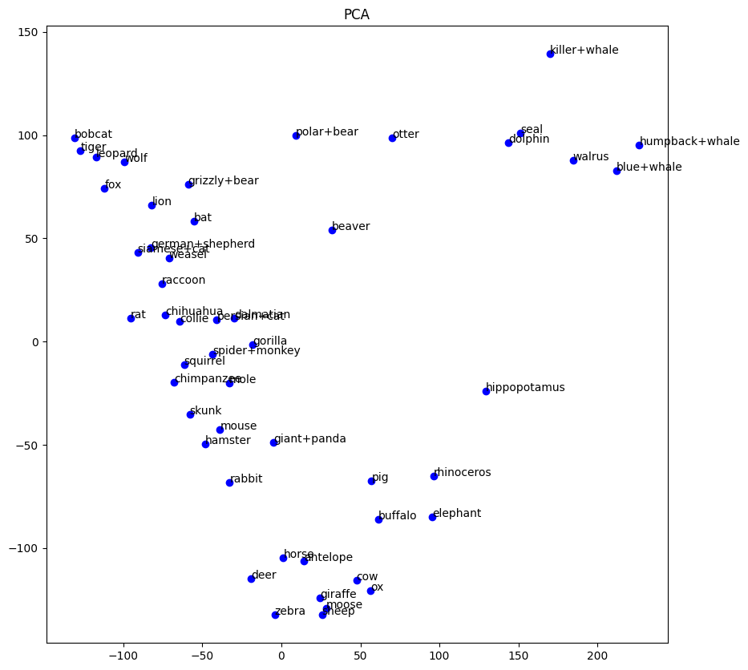
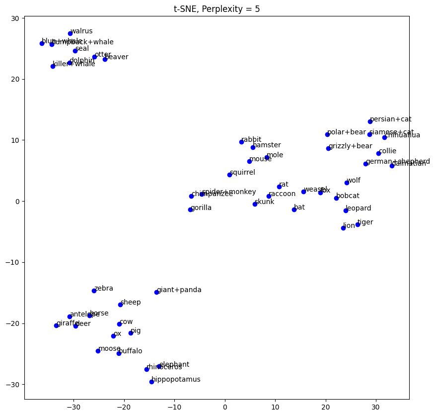
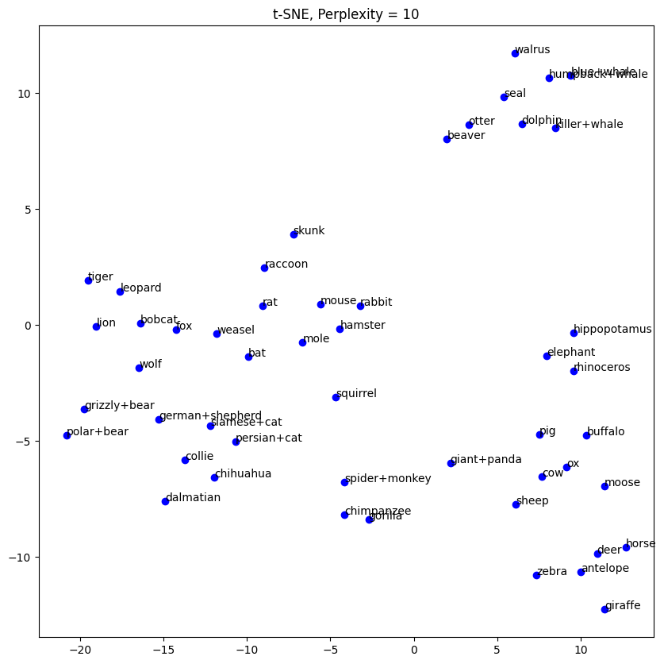
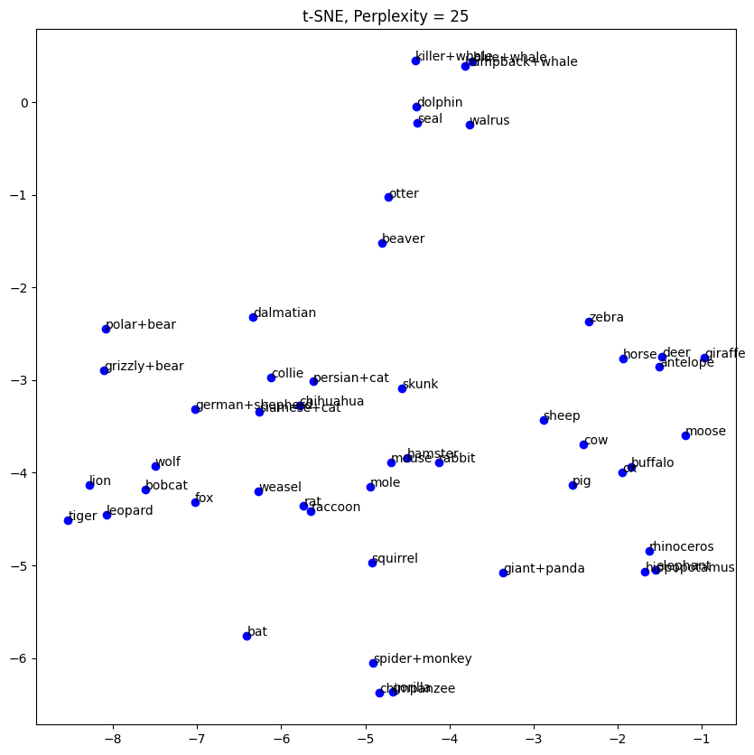
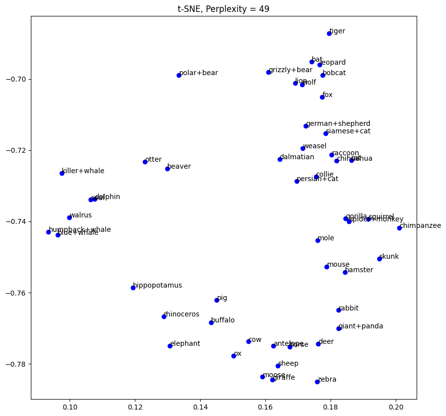

# Visualizing-high-dimensions

This repo illustrates some simple visualization methods using the animals with attributes data set. This is a small data set that has information about 50 animals. The animals are listed in classes.txt. For each animal, the information consists of values for 85 features: does the animal have a tail, is it slow, does it have tusks, etc. The details of the features are in predicates.txt. The full data consists of a 50 × 85 matrix of real values, in predicate-matrix-continuous.txt.

Following is a visualization of these animals in 2D using PCA projection.

A popular visualization method is the t-SNE algorithm. This method takes a numerical parameter called the perplexity and then obtains an embedding by solving a non-convex optimization problem. The t-SNE algorithm can be invoked to get a 2-d embedding of a data set X. The perplexity has a significant effect on the output. Following figures show visualizations of animals for different perplexity values (5, 10, 25, 49).

 

 

 

 

How can we evaluate these embeddings? Some might seem more visually pleasing than others or might seem to group animals in a way that agrees more with our own intuitions. Let’s look at a somewhat more objective measure. Say we have a data set of n points $x_1, \ldots, x_n \in \mathbb{R}^d$ and we somehow obtain a 2-d visualization $z_1, \ldots, z_n \in \mathbb{R}^2$ of them. How accurately does this 2-d embedding capture the original interpoint distances? To see this, 

* Define $D_{ij} = ||x_i − x_j||$ and $\hat{D}_{ij} = ||z_i − z_j||$.
* In general, the D values might be scaled differently from the $\hat{D}$ values; so define the scaling factor to be c = $\frac{mean(D)}{mean(\hat{D})}$, where mean(·) denotes the average over all $n^2$ entries of the matrix.
* The multiplicative factor by which the distance between $x_i$ and $x_j$ is distorted can be defined by $\Delta_{ij} = max \left(\frac{D_{ij}}{c \cdot \hat{D}_ {ij}}, \frac{c \cdot \hat{D}_{ij}}{Dij}\right)$. This ratio is always ≥ 1.
* The average distortion is then mean($\Delta$).

The following table shows the average distortion for each of the five embeddings shown above (PCA and four t-SNE embeddings). Lower the distortion, better the embedding.

|Method | Average distortion |
| --- | --- |
| PCA | 1.815 |
| t-SNE (perplexity = 5) | 1.944 |
| t-SNE (perplexity = 10) | 1.675 |
| t-SNE (perplexity = 25) | 1.601 |
| t-SNE (perplexity = 49) | 1.693 |
